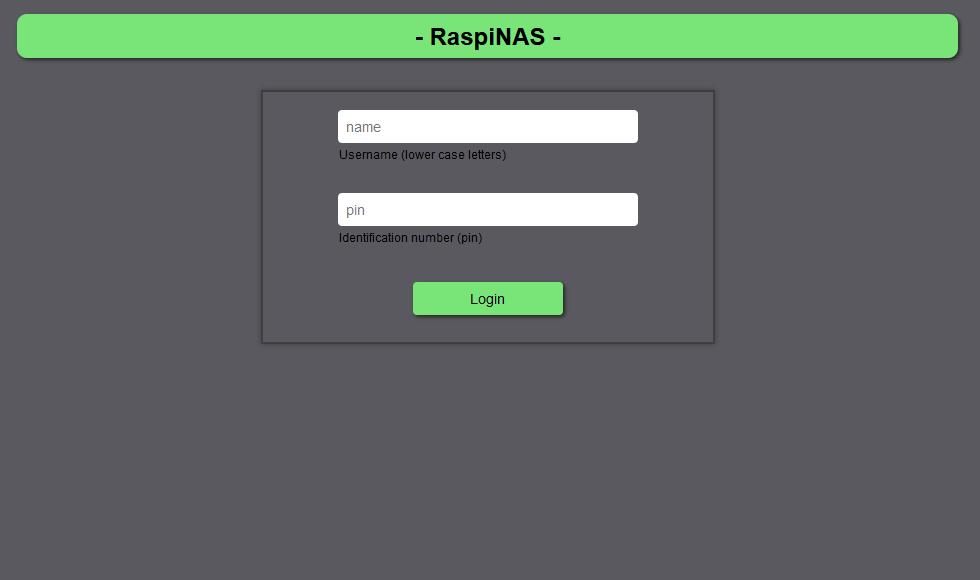
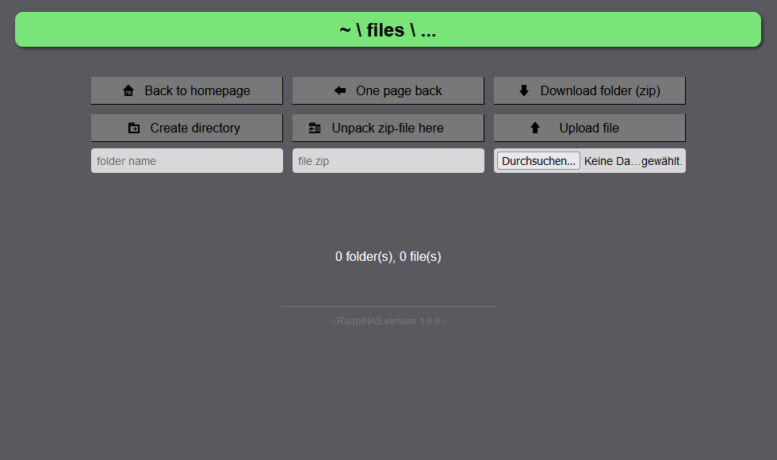

# Python RaspiNAS

*-- German Version --*

## Generelle Informationen:

Python RaspiNAS ist eine extrem simple, leichtgewichtige Nutzeroberfläche, die für den Einsatz in einer privaten NAS-Umgebung entwickelt wird. Das Ziel dabei ist, das NAS mithilfe einer Weboberfläche und ohne komplizierte Integrationen in Betriebsysteme von möglichst jedem internetfähigen Gerät und jedem Betriebssystem erreichen zu können.

Zusätzlich soll der Code besonders kurz und übersichtlich gehalten werden, damit jederzeit nachvollziehbar bleibt, was wo mit den eigenen Daten passiert, sowie, um eine einfache Erweiterbarkeit zu gewährleisten. Das gesamte Projekt ist dabei in Python geschrieben (auch der benötigte HTML Code befindet sich in den Python-Dateien). Das verwendete Framework im Hintergrund ist [Bottle](https://bottlepy.org).

Ein [Raspberry Pi](https://www.raspberrypi.org/) kann als Server verwendet werden, ist aber keine Pflicht. Linux ist für eine möglichst simple Einrichtung auf der Serverseite allerdings empfohlen.

Derzeit bin ich der einzige Entwickler hinter diesem Projekt, wodurch es zunächst nur in unregelmäßigen Abständen Updates/Releases geben wird. Allerdings freue ich mich jederzeit über Verbesserungsvorschläge, sonstige Anregungen und Kritik.

## Einrichtung

1. Vorbereitung:
   * Die derzeit empfohlene Python Version ist 3.10.9. [Bottle](https://bottlepy.org) wurde in der Version 0.12.23 genutzt (aktuellere sollten funktionieren).
   * Mehr Informationen befinden sich in `requirements.txt`. Installation: `pip3 install -r requirements.txt`
   * Als serifenlose Schriftart im Browser empfiehlt sich Arial oder Roboto.
   * Standardmäßig werden Daten in Ordnern ausgehend vom Installationsverzeichnis der `server.py` Datei gespeichert. In diesem Fall **muss** dieses Verzeichnis auf der gleichen Festplatte liegen, auf der später die Daten abgelegt werden sollen.

2. Erstellen und Löschen von Nutzern:
   * Als Beispiel wird der Nutzer `guest` mit dem Passwort `123` mitgeliefert.
   * Zum Anlegen von Nutzern kann die Datei `add_users.py` ohne Parameter mit Python ausgeführt werden. Diese sollte selbsterklärend sein, bei Bedarf befinden sich weitere Informationen in der Datei.
   * Um einen Nutzer vollständig zu Löschen, müssen die Ordner mit dessen Namen aus `users` und `temp` gelöscht werden. Danach muss die Zeile mit seinem Namen aus `usernames.dat` und sein Hashwert aus `userdata.dat` (**gleiche Zeilennummer/Position**) entfernt werden.
   * **Achtung:** beim Löschen muss unbedingt beachtet werden, dass man die richtigen Zeilen entfernt und beide Dateien am Ende die gleiche Zeilenanzahl besitzen (mit einem Zeilenumbruch am Ende). Bei wenigen Nutzern empfiehlt es sich, die Dateien zu löschen und mittels `add_users.py` neu zu generieren.

3. Einrichtung des Servers:
   * Die Konfiguration und Personalisierung des Servers erfolgt in der Datei `config.json`. Er ist aber auch mit den Standardeinstellungen lauffähig.

| Key          | Value (Erklärung)                                                                         |
|--------------|-------------------------------------------------------------------------------------------|
| language     | Einstellung der Sprache (`de` oder `en`)                                                  |
| host_ip      | IP-Adresse, auf der Anfragen empfangen werden (`0.0.0.0` - alle, `localhost` - nur lokal) |
| port         | Port für die Kommunikation (`443` - standardmäßiger HTTPS-Port)                           |
| socket_port  | Port für eingehende Verbindungen der Socket-Schnittstelle                                 |
| storage_path | Pfad/Ort, an dem die hochgeladenen Daten gespeichert werden                               |
| cert_file    | Name oder Pfad des SSL Zertifikats                                                        |
| key_file     | Name oder Pfad der SSL Key-Datei                                                          |
| owner        | Name des Besitzers, um die Weboberfläche zu personalisieren                               |

4. Erstellen eines selbst-signierten SSL-Zertifikates (mehr Details bei [Baeldung](https://www.baeldung.com/openssl-self-signed-cert)):
   * Zunächst muss OpenSSL installiert sein (`sudo apt install openssl` / `sudo pacman -S openssl`).
   * Die nun folgenden Befehle sollten im Hauptverzeichnis (normal `Python-RaspiNAS/`) ausgeführt werden. Alternativ können sie angepasst werden, um das Zertifikat mit anderen Voreinstellungen und/oder an einem anderen Ort zu speichern.
     * Die Key-Datei generieren: `openssl genrsa -out raspinas.key 2048`
     * Eine "certificate signing request" erstellen: `openssl req -key raspinas.key -new -out raspinas.csr` 
       (Teilweise kann es vorkommen, dass vom Browser später ein Eintrag im "Common Name" Feld erwartet wird.)
     * Das Zertifikat erzeugen: `openssl x509 -signkey raspinas.key -in raspinas.csr -req -days 365 -out raspinas.crt` 
       (Die Gültigkeitsdauer des Zertifikates in Tagen kann nach Belieben verändert werden.)

5. Starten des Servers:
   * Da sich das Projekt zur Nutzung auf dem [Raspberry Pi](https://www.raspberrypi.org/) eignet, zunächst ein Hinweis hierfür: Damit der Server auch nach dem schließen einer SSH-Verbindung weiterläuft, eignet sich [screen](https://www.gnu.org/software/screen/) als Tool.
   * Befindet man sich mit dem Terminal im Hauptverzeichnis, kann er ganz einfach mit dem Befehl `python3 server.py` gestartet werden.
   * Durch die verwendeten Socket-Verbindungen muss das Programm mit erhöhten Rechten ausgeführt werden (z.B. `sudo`). Dies kann mit ein paar Tricks umgangen werden, was jedoch mit Python als Interpretersprache nicht ganz einfach ist.

6. Beenden des Servers:
   * Der wohl einfachste Schritt: (screen -r) und STRG + C

> Hinweis: 
> Das Programm sollte derzeit ausschließlich auf einem nicht öffentlich erreichbaren Heimserver genutzt werden. Die Anmeldedaten werden mittels SHA384 gehasht und über einen mit einem zufälligen SECRET-Token gesicherten Cookie übertragen. Auch die Verbindung wird inzwischen per SSL/TLS abgesichert, aber es existiert aktuell keinerlei Schutz gegen spezifische Angriffe auf den Server (z.B. Brute-Force-Attacken).

---

*-- English Version --*

## General information:

Python RaspiNAS is an extremely simple, lightweight user interface, which is developed for the use in a private NAS-environment. With a web interface and without complex integrations into operating systems, the goal is to make the NAS accessible from every web-enabled device and any operating system.

Furthermore the code shall be particularly short and clear to make it traceable what happens where with one's own data and to ensure a good extensibility. The whole project is written in Python (the needed HTML code can be found in Python files too). The used framework is [Bottle](https://bottlepy.org).

A [Raspberry Pi](https://www.raspberrypi.org/) can be used as server hardware, although it isn't necessarily needed. Linux however is recommended on the server side to ensure the setup being as simple as possible.

Currently I'm the only developer behind the project. For that reason, there will only be updates/releases at irregular intervals for now. Despite that I would be pleased about any improvement suggestions, other suggestions or criticism.

## Setup

1. Preparation:
   * The currently recommended Python version is 3.10.9. [Bottle](https://bottlepy.org) was tested with version 0.12.23 (newer should work).
   * More information can be found in `requirements.txt`. Installation: `pip3 install -r requirements.txt`
   * Arial or Roboto are recommended as sans serif fonts in the browser.
   * By default, the data will be stored in directories starting from the installation home of the `server.py` file. In this case, this parent directory **must** be stored on the same hard drive as the one where the data will go.

2. Create and delete users:
   * As an example the user `guest` with his pin `123` is already created.
   * To create users yourself, start `add_users.py` without parameters using Python. It should be self-explaining but further information can be found directly in the file if needed.
   * To completely delete a user, the directories with his name have to be removed from  `users` and `temp` first. After that, the line containing his name must be deleted from `usernames.dat` and his hash-value from `userdata.dat` (**same line number/position**).
   * **Warning:** When deleting a user double check to remove the right lines and make sure that both files have the same line count afterwards (with one linebreak at the end). If there are only few users, I'd recommend deleting the file and regenerating it with `add_users.py`.

3. Server setup:
   * The configuration and personalization of the server is done in the `config.json` file. However, it should also run with the default settings.

| Key          | Value (Explanation)                                                                          |
|--------------|----------------------------------------------------------------------------------------------|
| language     | Configuration of the language (`de` or `en`)                                                 |
| host_ip      | IP address to listen for requests (`0.0.0.0` - listens everywhere, `localhost` - only local) |
| port         | Port for communication (`443` - default HTTPS port)                                          |
| socket_port  | Port for incoming connections of the socket interface                                        |
| storage_path | Path/location where uploaded files are stored                                                |
| cert_file    | Name or path of the SSL certificate file                                                     |
| key_file     | Name or path of the SSL key file                                                             |
| owner        | Name of the owner to personalize the web app                                                 |

4. Create a self-signed SSL certificate (more details at [Baeldung](https://www.baeldung.com/openssl-self-signed-cert)):
   * First, OpenSSL must be installed (`sudo apt install openssl` / `sudo pacman -S openssl`).
   * The following commands should be executed in the installation home (default `Python-RaspiNAS/`). Alternatively, they can be customized to save the certificate with different preferences and/or in a different location.
     * Generate the key file: `openssl genrsa -out raspinas.key 2048`
     * Create a certificate signing request: `openssl req -key raspinas.key -new -out raspinas.csr` 
       (Sometimes it can happen that the browser expects an entry in the "Common Name" field later.)
     * Generate the certificate: `openssl x509 -signkey raspinas.key -in raspinas.csr -req -days 365 -out raspinas.crt` 
       (The validity of the certificate in days can be changed at will.)

5. Starting the server:
   * Because the project is suitable for use on a [Raspberry Pi](https://www.raspberrypi.org/), first of all a hint for that: To make the server keep running after closing a SSH connection, you can use the tool [screen](https://www.gnu.org/software/screen/).
   * If you are using your Terminal in the installation home, just type the command `python3 server.py` to start the application.
   * Due to the socket connections used, the program must be executed with elevated privileges (e.g. `sudo`). This can be circumvented with a few tricks, but this isn't particularly easy with Python as an interpreter language.

6. Shutdown the server:
   * Probably the easiest part: (screen -r) and CTRL + C

> Note: 
> The program should currently only be used on a home server that is not publicly accessible. The login data is hashed using SHA384 and transferred via a cookie secured with a random SECRET token. The connection is now also secured via SSL/TLS, but there is currently no protection against specific attacks targeting the server (e.g. brute force attacks).
