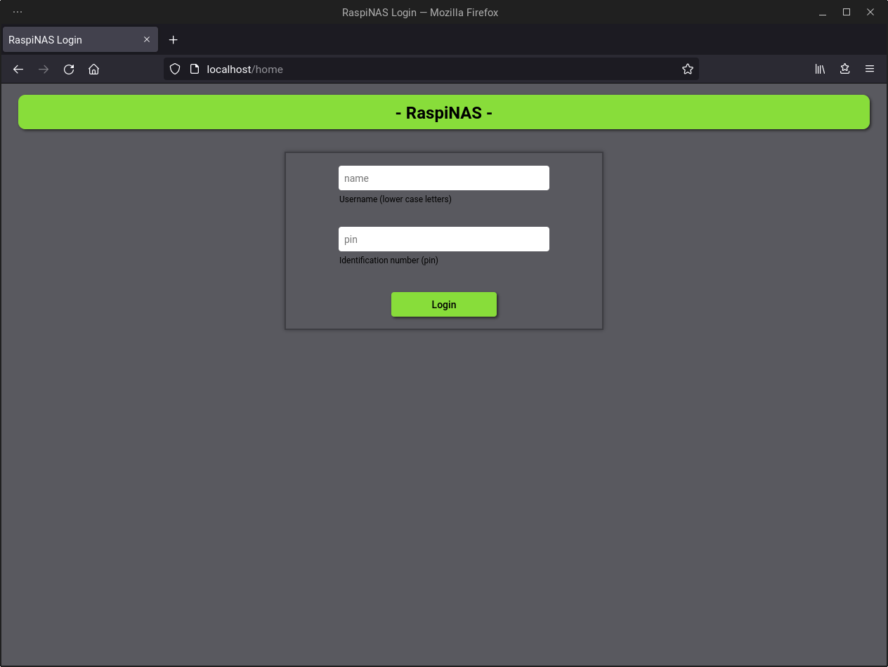
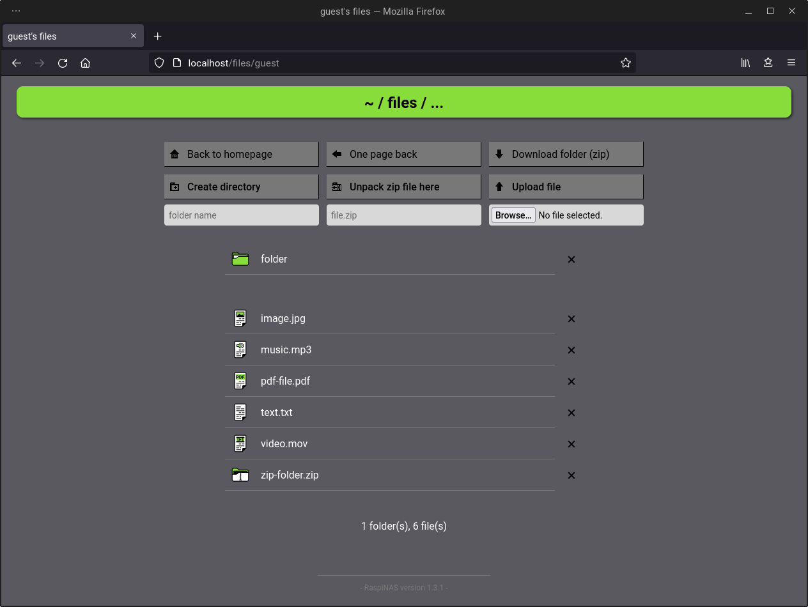

# Python RaspiNAS

*-- German Version --*

## Generelle Informationen:

Python RaspiNAS ist eine extrem simple, leichtgewichtige Nutzeroberfläche, die für den Einsatz in einer privaten NAS-Umgebung entwickelt wird. Das Ziel dabei ist, das NAS mithilfe einer Weboberfläche und ohne komplizierte Integrationen in Betriebsysteme von möglichst jedem internetfähigen Gerät und jedem Betriebssystem erreichen zu können.

Zusätzlich soll der Code besonders kurz und übersichtlich gehalten werden, damit jederzeit nachvollziehbar bleibt, was wo mit den eigenen Daten passiert, sowie, um eine einfache Erweiterbarkeit zu gewährleisten. Das gesamte Projekt ist dabei in Python geschrieben (auch der benötigte HTML Code befindet sich in den Python-Dateien). Das verwendete Framework im Hintergrund ist [Bottle](https://bottlepy.org).

Ein [Raspberry Pi](https://www.raspberrypi.org/) kann als Server verwendet werden, ist aber keine Pflicht. Linux ist für eine möglichst simple Einrichtung auf der Serverseite allerdings empfohlen.

Derzeit bin ich der einzige Entwickler hinter diesem Projekt, wodurch es zunächst nur in unregelmäßigen Abständen Updates/Releases geben wird. Allerdings freue ich mich jederzeit über Verbesserungsvorschläge, sonstige Anregungen und Kritik.

## Einrichtung

1. Vorbereitung:
   * Die empfohlene Python Version ist 3.10.1. [Bottle](https://bottlepy.org) wurde in der Version 0.12.19 genutzt (aktuellere können funktionieren).
   * Mehr Informationen befinden sich in `requirements.txt`. Installation: `pip3 install -r requirements.txt`
   * Als serifenlose Schriftart im Browser empfiehlt sich Arial oder Roboto.
   * Standardmäßig werden Daten in Ordnern ausgehend vom Installationsverzeichnis der `server.py` Datei gespeichert. In diesem Fall **muss** dieses Verzeichnis auf der gleichen Festplatte liegen, auf der später die Daten abgelegt werden sollen.

2. Erstellen und Löschen von Nutzern:
   * Als Beispiel wird der Nutzer `guest` mit dem Passwort `123` mitgeliefert.
   * Zum Anlegen von Nutzern kann die Datei `add_users.py` ohne Parameter mit Python ausgeführt werden. Diese sollte selbsterklärend sein, bei Bedarf befinden sich weitere Informationen in der Datei.
   * Um einen Nutzer vollständig zu Löschen, müssen die Ordner mit dessen Namen aus `users` und `temp` gelöscht werden. Danach muss die Zeile mit seinem Namen aus `usernames.dat` und sein Hashwert aus `userdata.dat` (**gleiche Zeilennummer/Position**) entfernt werden.
   * **Achtung:** beim Löschen muss unbedingt beachtet werden, dass man die richtigen Zeilen entfernt und beide Dateien am Ende die gleiche Zeilenanzahl besitzen (mit einem Zeilenumbruch am Ende). Bei wenigen Nutzern empfiehlt es sich, die Dateien zu löschen und mittels `add_users.py` neu zu generieren.

3. Einrichtung der `server.py` Datei:
   * In dieser Datei befinden sich zusätzliche Konfigurationsoptionen direkt nach den Imports unter `Server configuration and personalization`.
   * Dort können Sprache, IP, Port, ein anderer Speicherpfad für die Dateien, ein Besitzername und der Filter für Ordnernamen angepasst werden, das Programm ist aber auch mit den Standardeinstellungen lauffähig.

4. Starten des Servers:
   * Da sich das Projekt zur Nutzung auf dem [Raspberry Pi](https://www.raspberrypi.org/) eignet, zunächst ein Hinweis hierfür: Damit der Server auch nach dem schließen einer SSH-Verbindung weiterläuft, eignet sich [screen](https://www.gnu.org/software/screen/) als Tool.
   * Befindet man sich mit dem Terminal im Hauptverzeichnis (normal `Python-RaspiNAS/`), kann er ganz einfach mit dem Befehl `python3 server.py` gestartet werden.
   * Ein mögliches Problem, dass Schreibrechte beim Ordnermanagement durch Python fehlen, kann - wenn man dem Code vertraut - durch die Ausführung mit `sudo` behoben werden. Eine alternative und bessere Lösung ist die Nutzung der Rechteverwaltung unter Linux.

5. Beenden des Servers:
   * Der wohl einfachste Schritt: (screen -r) und STRG + C

> Hinweis: 
> Das Programm sollte derzeit ausschließlich auf einem nicht öffentlich erreichbaren Heimserver genutzt werden. Auch wenn die Anmeldedaten mittels SHA224 gehasht und über einen mit einem zufälligen SECRET-Token gesicherten Cookie übertragen werden, sind die Dateien beim Up- und Download allerdings **nicht** verschlüsselt oder anderweitig geschützt.

---

*-- English Version --*

## General information:

Python RaspiNAS is an extremely simple, lightweight user interface, which is developed for the use in a private NAS-environment. With a web interface and without complex integrations into operating systems, the goal is to make the NAS accessible from every web-enabled device and any operating system.

Furthermore the code shall be particularly short and clear to make it traceable what happens where with one's own data and to ensure a good extensibility. The whole project is written in Python (the needed HTML code can be found in Python files too). The used framework is [Bottle](https://bottlepy.org).

A [Raspberry Pi](https://www.raspberrypi.org/) can be used as server hardware, although it isn't necessarily needed. Linux however is recommended on the server side to ensure the setup being as simple as possible.

Currently I'm the only developer behind the project. For that reason, there will only be updates/releases at irregular intervals for now. Despite that I would be pleased about any improvement suggestions, other suggestions or criticism.

## Setup

1. Preparation:
   * The recommended Python version is 3.10.1. [Bottle](https://bottlepy.org) was tested with version 0.12.19 (newer could still work).
   * More information can be found in `requirements.txt`. Installation: `pip3 install -r requirements.txt`
   * Arial or Roboto are recommended as sans serif fonts in the browser.
   * By default, the data will be stored in directories starting from the installation home of the `server.py` file. In this case, this parent directory **must** be stored on the same hard drive as the one where the data will go.

2. Create and delete users:
   * As an example the user `guest` with his pin `123` is already created.
   * To create users yourself, start `add_users.py` without parameters using Python. It should be self-explaining but further information can be found directly in the file if needed.
   * To completely delete a user, the directories with his name have to be removed from  `users` and `temp` first. After that, the line containing his name must be deleted from `usernames.dat` and his hash-value from `userdata.dat` (**same line number/position**).
   * **Warning:** When deleting a user double check to remove the right lines and make sure that both files have the same line count afterwards (with one linebreak at the end). If there are only few users, I'd recommend deleting the file and regenerating it with `add_users.py`.

3. Setup of `server.py`:
   * This file contains additional configuration options which are located right after the import section (marked with `Server configuration and personalization`).
   * There the language, ip, port, a different target directory for uploaded files, the name of the owner und a directory naming filter can be changed, although you can still run the program with default settings.

4. Starting the server:
   * Because the project is suitable for use on a [Raspberry Pi](https://www.raspberrypi.org/), first of all a hint for that: To make the server keep running after closing a SSH connection, you can use the tool [screen](https://www.gnu.org/software/screen/).
   * If you are using your Terminal in the installation home (default `Python-RaspiNAS/`), just type the command `python3 server.py` to start the application.
   * A potential problem caused by missing writing permissions when Python tries to manage directories can be solved using `sudo` - if you trust the code. An alternative and better solution is to use the Linux rights management.

5. Shutdown the server:
   * Probably the easiest part: (screen -r) and CTRL + C

> Note: 
> The program should currently only be used on a home server that is not publicly accessible. Even though the login data is hashed using SHA224 and transferred via a cookie secured with a random SECRET token, the files are **not** encrypted or otherwise protected during upload and download.
